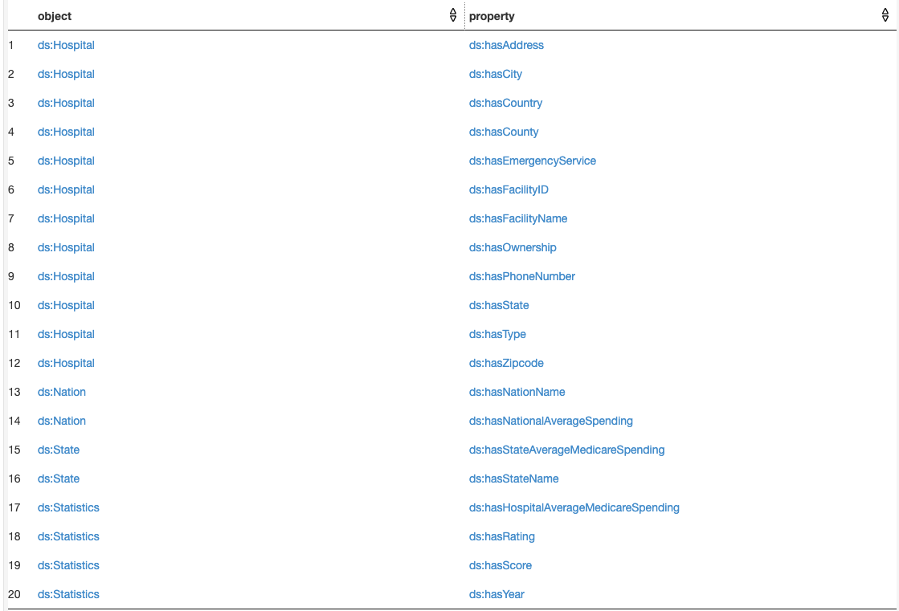

# Project 3 - Semantic Data Retrieval​

CECS 571 - Semantic Web

Spring 2020

---

## Usage

### Running the Webserver (Apache Fuseki 3.14)

```bash
./apache-jena-fuseki-3.14.0/fuseki-server
```

This will run a small webserver at localhost:3030/

- If permission denied, change permission to executable with:

```bash
chmod +x fuseki-server
```

---

## Fuseki Guide

- Fuseki has dataset Hospital by default. If the dataset is not available, please create and upload Hospital.owl

- For query, please use these prefixes:

```
PREFIX rdf: <http://www.w3.org/1999/02/22-rdf-syntax-ns#>
PREFIX rdfs: <http://www.w3.org/2000/01/rdf-schema#>
PREFIX owl: <http://www.w3.org/2002/07/owl#>
PREFIX xsd: <http://www.w3.org/2001/XMLSchema#>
PREFIX ds: <https://data.medicare.gov/d/nrth-mfg3#>
```

- List of class and properties in the Hospital.owl ontology. Please use this to guide your query.



---

## Folder Structure

```
├── Hospital.owl
├── README.md
├── apache-jena-fuseki-3.14.0
├── assets
│   ├── class-properties-pairs.png
│   ├── full.png
│   ├── hospital.png
│   ├── nation.png
│   └── state.png
├── deliverables
│   ├── Q1
│   │   ├── Q1_output.png
│   │   ├── Q1_query.txt
│   │   └── Q1_question.txt
│   ├── Q2
│   │   ├── Q2.txt
│   │   ├── Q2_output.png
│   │   └── Q2_query.txt
│   ├── Q3
│   │   ├── Q3.txt
│   │   ├── Q3_output.png
│   │   └── Q3_query.txt
│   ├── Q4
│   │   ├── Q4.txt
│   │   ├── Q4_output.png
│   │   └── Q4_query.txt
│   └── Q5
│       ├── Q5.txt
│       ├── Q5_output.png
│       └── Q5_query.txt
```

- Query file can be copy and paste directly into Fuseki to verify the output.
- Each question's question, query and output is in deliverables.

---

## Team

[Liam Nguyen](https://github.com/liam-nguyen)

[Loc Huynh](https://github.com/lhinh)

Phuc Dang

[Suchitra Chinnamail](https://github.com/suchitrareddy1195)

Varun Lingabathini

---
